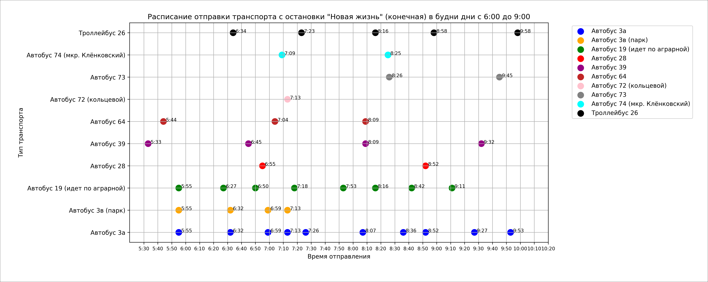

# transport-shedule-visualiser

## Описание
Этот проект визуализирует расписание общественного транспорта на графике: по оси X — время отправления, по оси Y — вид общественного транспорта.
## Установка
Для работы с проектом вам понадобятся следующие библиотеки:
- `matplotlib`
- `numpy`
- `PIL` (или `Pillow`)

1. Скачайте или клонируйте репозиторий:
```sh
git clone https://github.com/marchenkovma/transport-schedule-visualizer.git
```
2. Перейдите в папку с проектом:
```
cd transport-schedule-visualizer
```
3. Установите необходимые библиотеки, используя pip:
```sh
pip install -r requirements.txt
```
## Использование
1. Запустите основной скрипт:
```sh
python app.py
```
2. Это создаст график расписания и сохранит его в файл `transport_sv.png`. При необходимости, вы можете изменить данные о транспорте в файле `app.py`, отредактировав словарь `transport_times`.
3. После создания графика, вы можете разрезать его на части для печати на формате A4, вызвав функцию `split_image` (функцию нужно раскомментировать в файле `app.py`).
## Внести вклад
Если вы хотите внести изменения или улучшения в проект, пожалуйста, создайте pull request или откройте issue в репозитории.
## Лицензия
Этот проект лицензируется на основе лицензии [MIT](LICENSE).